<!--
  GitHub Profile README for https://github.com/BrKDDD
  Publish this file as README.md in a PUBLIC repository named exactly: BrKDDD
-->

  
  
  

## 👋 About Me / 关于我

- 🎓 Robotics Engineering student at **Jiaxing University** / 嘉兴大学机器人工程专业
- 🤖 Interested in **robotics integration, embodied AI, perception, and intelligent agents**
- 🧩 I enjoy turning ideas into explainable, testable, end-to-end systems
- 🌱 Currently exploring robot learning, visual manipulation, and practical AI deployment
- 💬 Languages: Chinese (native) · English (learning)

## 🛠️ Tech Stack

## 🚀 Featured Projects

| Project | What it does | Stack |
|:--|:--|:--|
| [**Ouster Web Studio**](https://github.com/BrKDDD/ouster-web-studio) | Cross-platform browser workspace for Ouster LiDAR connectivity, PCAP/OSF playback, filtering, and 3D point-cloud visualization. | `Python` `FastAPI` `Three.js` |
| [**Red Boat Spirit**](https://github.com/BrKDDD/red-boat-spirit) | Interactive historical-learning platform with knowledge-node navigation, streaming AI dialogue, and learning summaries. | `React` `TypeScript` `Express` `LLM` |
| [**Diary Agent**](https://github.com/BrKDDD/diary_agent) | Local voice-diary pipeline covering audio sync, ASR transcription, cleanup, summarization, and traceable reports. | `Python` `FunASR` `SenseVoice` |
| [**LawAgent**](https://github.com/BrKDDD/lawagent) | Legal assistant combining RAG retrieval, ReAct-style tools, and blockchain evidence notarization. | `LlamaIndex` `DeepSeek` `Web3.py` |
| [**GPT Image UI Panel**](https://github.com/BrKDDD/gpt-image-ui-panel) | Lightweight desktop panel for testing and batch-running OpenAI-compatible image-generation endpoints. | `Python` `Tkinter` `OpenAI API` |

## 📊 GitHub Analytics

### “Build it, test it, and make it useful.”

